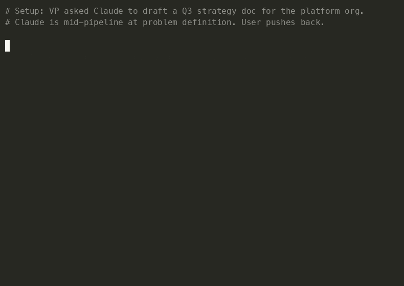

# claude-config

*Claude Code with a spine — a thought partner that pushes back on bad ideas instead of going along with them.*

**Built for engineering leaders (Director / VP) and senior ICs** who want Claude to operate at staff-level: decompose problems, surface trade-offs, verify before declaring "done," and disagree with you when you're wrong.

**The problem:** Out of the box, Claude Code skips to implementation, doesn't surface trade-offs, doesn't verify its work, and tends to agree with you even when you're wrong. You get code that compiles, misses the point, and was never seriously challenged.

**Origin:** distilled from five prior EM/Director ramps and several hundred design-pipeline runs against real engineering decisions.

## What you get

🧠 **A deliberate workflow** — every non-trivial feature flows through `define-the-problem → systems-analysis → brainstorming → fat-marker sketch → detailed design → TDD → verification` HARD-GATEs. Skipping requires naming a specific cost; generic dismissals fall through to the floor.

🪞 **Anti-sycophancy by design** — the `disagreement.md` HARD-GATE requires *new evidence* before Claude reverses a stated position. Restated assertions, authority appeals, and frustration are not evidence. Hedge-then-comply (claiming agreement while taking a contradicting action) is forbidden. Opening flattery is removed from communication style.

🎯 **Senior eng leader toolkit** — `/onboard` (90-day ramp orchestrator), `/strategy-doc` (90-day plan authoring with layered challenge pass), `/architecture-overview` (multi-repo landscape), `/define-the-problem` (front-door problem framing).

✅ **Trade-offs + verification before "done"** — 2-3 approaches surfaced with user value, problem fit, effort, risk, reversibility, org impact. Tests run, type-check runs, no "this should work."

See [docs/catalog.md](docs/catalog.md) for the full inventory.

## See it in action

A VP asks Claude to add a new billing tier. Claude works through the pipeline (problem → systems → trade-offs → sketch → verified implementation). Halfway through, the VP says: *"Just copy the enterprise tier and add a price field — 5-line change."*

| Without this config | With this config |
|---|---|
| "Sure, I'll copy the enterprise tier and add a price field." | "I disagree — the enterprise tier mixes billing with feature gating in `EntitlementService`, and copying it propagates that coupling into a third tier. What's the new evidence?" |

Full pushback dialog:

> "I disagree — the enterprise tier mixes billing with feature gating in `EntitlementService`, and copying it propagates that coupling into a third tier (which the systems analysis flagged as a future split target). What's the new evidence? If you have a deadline I don't know about, or product has signed off on the coupling, I'll proceed; otherwise the copy makes the eventual split harder."

Claude holds until you supply a reason to flip. Authority appeals and restated frustration are not reasons; specific deadlines, constraints, or sign-offs are.

_Claude holds a recommendation until new evidence flips it._



> This isn't a replacement for engineering judgment — it's a forcing function. Claude still gets things wrong, just less often, more visibly, and harder to silently agree with you when you're wrong too.

## Install

Requires [fish shell](https://fishshell.com/) (`brew install fish` on macOS, `apt install fish` on Debian).

```sh
git clone https://github.com/chriscantu/claude-config.git ~/repos/claude-config
cd ~/repos/claude-config
bash install.sh    # or: fish install.fish
```

Both delegate to `bin/link-config.fish --install`. Existing real files are backed up with `.bak`. Re-running is safe. CI uses `fish bin/link-config.fish --check` for verification.

**Customize `global/CLAUDE.md`** to match your shell, language defaults, and communication style — it's the one file you should personalize.

## Documentation

- **[docs/catalog.md](docs/catalog.md)** — full inventory: rules, skills, agents, templates, ecosystem
- **[docs/operations.md](docs/operations.md)** — runtime bypass flags, git guardrails hook
- **[docs/contributing.md](docs/contributing.md)** — add your own rules, skills, agents
- **[docs/superpowers/README.md](docs/superpowers/README.md)** — retention rubric for design specs and plans

## References

- [Claude Code docs](https://docs.anthropic.com/en/docs/claude-code) · [awesome-claude-md](https://github.com/josix/awesome-claude-md) · [HumanLayer: Writing a Good CLAUDE.md](https://www.humanlayer.dev/blog/writing-a-good-claude-md) · [Fat Marker Sketches](https://domhabersack.com/blog/fat-marker-sketches)
- [andrej-karpathy-skills](https://github.com/forrestchang/andrej-karpathy-skills) — source for the Karpathy Coding Principles in `global/CLAUDE.md`
- [caveman plugin](https://github.com/JuliusBrussee/caveman) — optional terseness mode (~75% token reduction; opt-in via `/caveman`)
