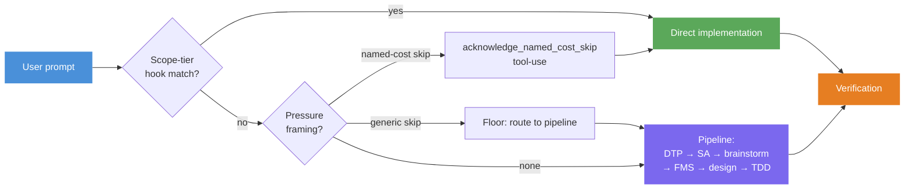
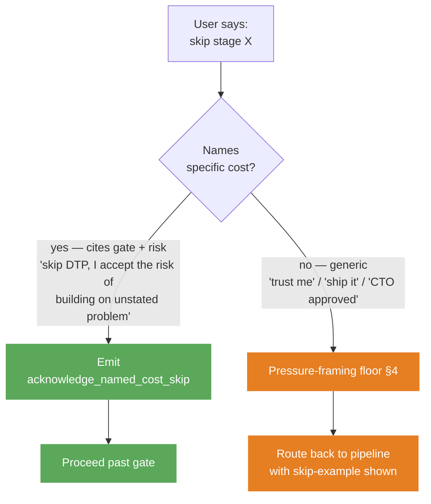
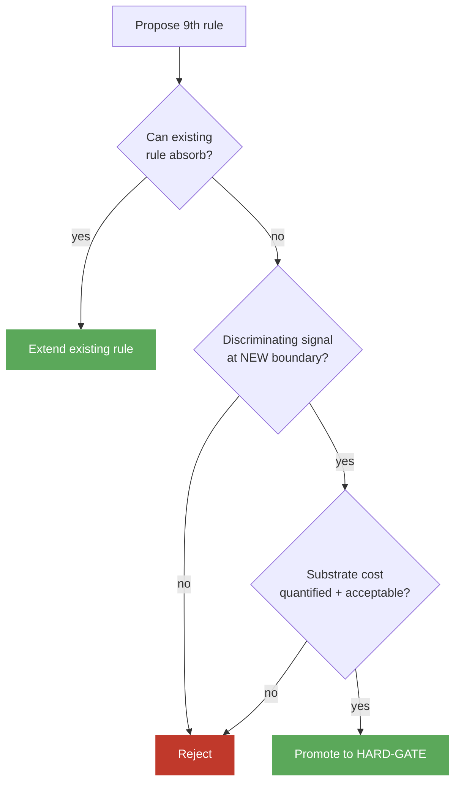

# Mental Model

Claude Code defaults to a particular failure mode. It skips to implementation, picks an approach without surfacing trade-offs, codes without verifying, and tends to agree with you when you push back — even when you're wrong. This repo's job is to make those failures structurally hard.

The fix is not a longer system prompt or a smarter model; both are bypassable. It's a workflow with checkpoints that produce auditable artifacts, paired with a discipline for when checkpoints can legitimately be skipped. Eight concepts make that workflow work. Once you've internalized them, the rules layer stops looking like ceremony and starts looking like the shape of the discipline.

Read this once before touching rules, skills, or evals. After it, you should be able to open any rule file and predict which of the eight concepts it implements.

## How a prompt actually moves through the system

The diagram below is the shape of every Claude interaction in this config. The rest of the doc is a guided tour of the boxes:

The tour walks from the most operational concepts (what a contributor uses every day) to the governance concepts that keep the operational ones from rotting.

## 1. The pipeline — the default path

*This is what you'll see whenever you ask Claude to build, refactor, or design something non-trivial.*

The default path for any non-trivial prompt runs through seven sequential stages:

**DTP** (Define The Problem) → **SA** (Systems Analysis) → **Brainstorming** → **FMS** (Fat Marker Sketch) → **Detailed Design** → **TDD** → **Verification**

Each stage exists because Claude — left alone — tends to skip it. DTP forces a named user and concrete stakes before any solution. Systems Analysis forces a blast-radius scan before a design. Brainstorming forces 2-3 approaches with trade-offs instead of a silent pick. The Fat Marker Sketch forces a visual shape before pixel detail (refactors die quietly when the shape is wrong). TDD writes a failing test before the implementation. Verification runs tests, type-check, and a goal-direction sanity check before claiming done.

Stages are HARD-GATEs — Claude cannot proceed past one without producing the artifact that stage owns (a problem statement, a surface scan, a trade-off matrix, a sketch, a verify command output). Transitions are announced visibly so the user can audit the path Claude is taking.

Canonical source: [`rules/planning-pipeline.md`](../rules/planning-pipeline.md).

## 2. Scope-tier routing — the fast lane

*You'll see this on small mechanical work: typo fixes, single-file edits, docs-only changes.*

Most prompts aren't non-trivial, and forcing every typo fix through DTP would be a tax. A hook (`hooks/scope-tier-memory-check.sh`) checks every `UserPromptSubmit` against stored `feedback` memories. When one matches — e.g., a memory saying "trivial mechanical changes skip DTP/SA/brainstorm/FMS" — it injects a `SCOPE-TIER MATCH:` system-reminder. The agent acknowledges in one visible line, then routes straight to single-implementer implementation.

This is the fast lane around the pipeline, but it's deliberately layered. The hook fires first (Layer 1, structural). If it doesn't match, the pressure-framing floor (Layer 2, rule text) evaluates. If neither fires, the prompt gets the full pipeline. Both layers share the `DISABLE_PRESSURE_FLOOR` sentinel file — one off-switch for emergency rollback if a hook misfires badly.

When the hook misses, the rules layer still has a fallback: the Trivial-tier four-criteria carve-out (≤200 LOC, single component, unambiguous approach, low blast radius). Both routes converge on the same destination — skip DTP/SA/brainstorm/FMS, but keep per-step verify checks and the end-of-work verification gate. The discipline relaxes; it doesn't disappear.

Canonical source: [`rules/pressure-framing-floor.md#scope-tier-memory-check`](../rules/pressure-framing-floor.md#scope-tier-memory-check).

## 3. Skip contracts — bypassing a stage on purpose

*You'll see this when you genuinely want to skip a gate the pipeline is enforcing.*

Sometimes the hook misses and a stage really is overhead — you've done the work in your head, or the situation is special. The skip contract names what counts as a legitimate bypass:

A valid skip cites the gate AND the specific risk being accepted. Generic acknowledgements — "trust me," "I accept the trade-off," "ship it" — fall through to the floor; they don't name what's being given up. Time pressure isn't an override either. "Demo in 10 minutes" and "ship by Friday" make the gate more important, not less, because a rushed unverified output is the most expensive thing to land.

Canonical source: [`rules/skip-contract.md`](../rules/skip-contract.md).

## 4. Pressure framing — what the floor catches

*You'll see this when a generic skip falls through and Claude routes you back to the pipeline.*

When a skip doesn't name a cost, the floor classifies the framing into one of five semantic categories. The categories match the underlying mechanism, not literal wording — "leadership signed off" and "CTO approved" are both Authority:

- **Authority** — "CTO approved," "legal signed off"
- **Sunk cost** — "already committed," "decision is made"
- **Exhaustion** — "I'm tired," "just give me code"
- **Deadline** — "ship by Friday"
- **Stated-next-step** — "skip DTP and brainstorm X"

Each strengthens the case for Expert Fast-Track (a condensed DTP that takes 30 seconds instead of five minutes), but none alone is a full skip. The floor is non-bypassable except via the `DISABLE_PRESSURE_FLOOR` sentinel — an intentionally visible emergency rollback that emits a banner the first time it fires in a session.

One architectural detail is worth noting: floor enforcement lives in the rules layer, not inside DTP itself. A skill cannot catch its own failure-to-load, so the front door has to sit upstream of any skill invocation.

Canonical source: [`rules/pressure-framing-floor.md`](../rules/pressure-framing-floor.md).

## 5. Emission contract — naming the cost isn't enough

*You'll see this anytime a skip is honored: the agent's next action must be a specific tool-use.*

Naming the cost is necessary but not sufficient. Words drift — they get rephrased, summarized, abbreviated, lost in compression. So when a skip is valid, the agent MUST invoke the `acknowledge_named_cost_skip` MCP tool, passing the gate name and the verbatim user clause, BEFORE proceeding. The tool-use *is* the honor.

This sounds bureaucratic until you realize what it buys. A tool invocation is a structural artifact: it appears in the transcript exactly once, with exact parameters, auditable by the substrate without LLM judgment. The substrate enforces the contract; the LLM can't talk its way around it. In autonomous loops the gate has exactly four exits — pass, mechanical carve-out, sentinel bypass, or hard-block-and-surface. Silent skip is structurally impossible.

Canonical source: [`rules/skip-contract.md#emission-contract`](../rules/skip-contract.md#emission-contract).

## 6. HARD-GATE cap — keeping the rules layer lean

*You'll see this if you ever propose adding a 9th HARD-GATE rule.*

The triad above (skip + floor + emission) only works if the rules layer stays small. Each rule runs on every prompt; the cumulative context becomes the bottleneck before any specific rule fires. Worse, behavioral concerns tend to overlap, so a new rule often duplicates discrimination an existing gate already owns — burning context budget without adding signal. To keep that from happening, the repo caps HARD-GATE rules at eight, and adding a ninth has to clear a three-condition gate:

The current eight: planning-pipeline, think-before-coding, fat-marker-sketch, goal-driven, verification, pr-validation, disagreement, memory-discipline, execution-mode. (`tdd-pragmatic` is soft guidance, not a HARD-GATE.)

Canonical source: [`rules/GOVERNANCE.md#hard-gate-cap`](../rules/GOVERNANCE.md#hard-gate-cap).

## 7. Discriminating signals — how a rule earns its slot

*You'll see this when authoring or editing a rule's eval suite.*

The "discriminating signal" condition in the cap above is the heart of how rules earn their slot. A rule passes only if its eval produces a behavioral signal that's RED when the rule is absent AND GREEN when it's present — measured at the rule's own boundary, not "somewhere in the rules layer." Without that, adding a rule is theater: two rules with overlapping concerns can both pass when only one is loaded, and the eval can't tell them apart.

The same discipline now applies one level down, at the skill layer ([ADR #0019](../adrs/0019-skill-eval-discriminating-signal-discipline.md), enforced by validate Phase 1r). Every `skills/<name>/evals/evals.json` needs at least one `"tier": "required"` assertion — the skill's own discriminating signal.

Canonical sources: [ADR #0005](../adrs/0005-behavioral-adr-promotion-requires-discriminating-signal.md), [ADR #0019](../adrs/0019-skill-eval-discriminating-signal-discipline.md).

## 8. Anchor pattern — keeping the citation graph from rotting

*You'll see this when restructuring a rule file or following a cross-rule deep-link.*

Rules cite each other constantly — `pr-validation.md` deep-links into `skip-contract.md#emission-contract`, and so on. GitHub's auto-generated heading IDs make that fragile: rename `## Emission contract — MANDATORY` to `## Emission contract` and every existing deep-link silently 404s. Anchor-text drift becomes the failure mode, and nothing catches it.

The fix is to put an explicit `` HTML anchor above each cited section. The id is stable across heading rewrites. Three validate phases enforce the citation graph: **Phase 1j** (anchors must exist), **Phase 1k** (cross-rule links must resolve), and **Phase 1l** (delegate paragraphs cannot be silently deleted). Together they catch the silent breakage that motivates the pattern in the first place.

Canonical source: [`rules/GOVERNANCE.md#stable-anchor-pattern`](../rules/GOVERNANCE.md).

---

## Where to go next

Pick by what you're about to do:

- **Editing a rule file** → [`rules/GOVERNANCE.md`](../rules/GOVERNANCE.md) for the cap policy and retirement procedure, plus [`docs/contributing.md`](contributing.md) for the contributor workflow.
- **Adding a skill or rule eval** → §7 above, then [ADR #0005](../adrs/0005-behavioral-adr-promotion-requires-discriminating-signal.md) and [ADR #0019](../adrs/0019-skill-eval-discriminating-signal-discipline.md).
- **Touching hooks or runtime ops** → [`docs/operations.md`](operations.md) for bypass flags and hook setup.
- **Just browsing the inventory** → [`docs/catalog.md`](catalog.md).
- **Want the decision history** → [`adrs/`](../adrs/). Every concept above traces to one or more ADRs.
