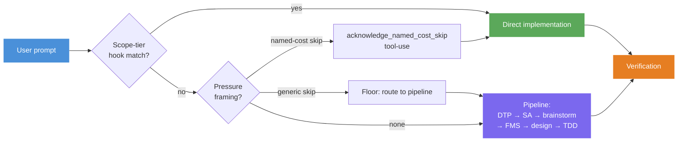
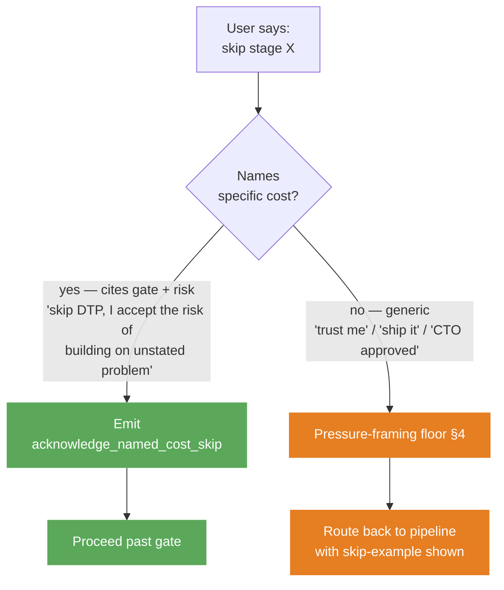
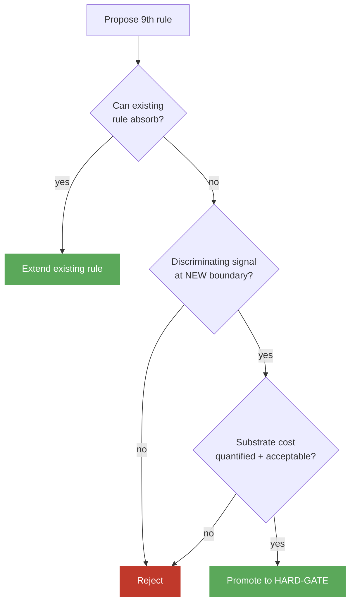

# Mental Model

The pipeline is what you see. The skip + pressure + emission triad is what makes it non-bypassable. Discriminating signals + anchor pattern + HARD-GATE cap are what keep it from rotting. Scope-tier routing is what keeps it from being theater on trivial work.

This doc names the eight load-bearing concepts that make the rest of the repo work. Read once before touching rules, skills, or evals.

## How a prompt flows through the system

Before the concepts, the shape:

The numbered sections below trace this diagram top-to-bottom: pipeline (the default path), scope-tier routing (the fast lane), skip + floor + emission (the discipline that keeps both honest), then the governance concepts that keep the whole thing from rotting.

## 1. The pipeline

*You'll meet this every time you ask Claude to build, refactor, or design anything non-trivial.*

Out of the box, Claude jumps to implementation, picks an approach without surfacing trade-offs, codes without verifying, and agrees when you push back. The pipeline is the structural counter:

**DTP** (Define The Problem) → **SA** (Systems Analysis) → **Brainstorming** → **FMS** (Fat Marker Sketch) → **Detailed Design** → **TDD** → **Verification**

Each stage owns one discriminating signal. DTP surfaces the *problem* (named user, current behavior, stakes). SA surfaces the *blast radius*. Brainstorming surfaces *trade-offs* (2-3 approaches with reasoning). FMS surfaces *shape* (visual structure before pixel detail). TDD writes a failing test first. Verification runs tests, type-check, and a goal-direction sanity check before claiming done.

Stages are HARD-GATEs — Claude cannot proceed past one without producing its artifact. Stage transitions are announced visibly so the user can audit the path.

Canonical source: [`rules/planning-pipeline.md`](../rules/planning-pipeline.md).

## 2. Scope-tier routing

*You'll meet this on small mechanical work — typo fixes, docs-only edits, single-file tweaks.*

Not every prompt needs the full pipeline. A hook (`hooks/scope-tier-memory-check.sh`) fires on every `UserPromptSubmit`. When it matches a stored `feedback` memory (e.g., "trivial mechanical changes skip DTP/SA/brainstorm/FMS"), it injects a `SCOPE-TIER MATCH:` system-reminder. The agent acknowledges in one visible line and routes directly to single-implementer implementation.

Compose order: hook (Layer 1, structural) fires first. If no match, pressure-framing floor (Layer 2, rule text) evaluates. If neither fires, full pipeline. Both layers share the `DISABLE_PRESSURE_FLOOR` sentinel — single off-switch for emergency rollback.

Fallback: the Trivial-tier four-criteria carve-out (≤200 LOC, single component, unambiguous approach, low blast radius) handles prompts without a hook match. Both routes converge: skip DTP/SA/brainstorm/FMS; keep goal-driven verify checks + verification end-gate.

Canonical source: [`rules/pressure-framing-floor.md#scope-tier-memory-check`](../rules/pressure-framing-floor.md#scope-tier-memory-check).

## 3. Skip contracts

*You'll meet this when you want to bypass a stage.*

Valid skip cites BOTH the gate AND the risk. Time pressure is not an override — *"demo in 10 minutes," "ship by Friday"* make the gate more important, not less. A rushed unverified output is the most expensive thing to land.

Canonical source: [`rules/skip-contract.md`](../rules/skip-contract.md).

## 4. Pressure framing

*You'll meet this when a generic skip falls through to the floor.*

The floor classifies generic skip framings into five semantic categories — match the underlying mechanism, not literal wording:

- **Authority** — "CTO approved," "legal signed off"
- **Sunk cost** — "already committed," "decision is made"
- **Exhaustion** — "I'm tired," "just give me code"
- **Deadline** — "ship by Friday"
- **Stated-next-step** — "skip DTP and brainstorm X"

Each strengthens the case for Expert Fast-Track (condensed DTP), not full skip. None alone is a named-cost skip. The floor is non-bypassable except via the `DISABLE_PRESSURE_FLOOR` sentinel file — an intentionally visible emergency rollback.

Architectural invariant: floor enforcement lives in the rules layer, NOT in DTP itself, because a skill cannot catch its own failure-to-load.

Canonical source: [`rules/pressure-framing-floor.md`](../rules/pressure-framing-floor.md).

## 5. Emission contract

*You'll meet this anytime a named-cost skip is valid — the agent's next action must be a specific tool-use.*

Naming the cost is necessary but not sufficient. When a skip is valid, the agent MUST invoke the `acknowledge_named_cost_skip` MCP tool, passing the gate name and the verbatim user clause, BEFORE proceeding. The tool-use IS the honor.

Why a tool call, not a text token? Text tokens drift — they get rephrased, summarized, abbreviated. A tool invocation is a structural artifact: appears in the transcript exactly once, with exact parameters, auditable by the substrate without LLM judgment. The substrate enforces the contract; the LLM can't talk its way around it.

In autonomous loops the gate has exactly four exits: pass, mechanical carve-out, sentinel bypass, hard-block-and-surface. Silent skip is structurally impossible.

Canonical source: [`rules/skip-contract.md#emission-contract`](../rules/skip-contract.md#emission-contract).

## 6. HARD-GATE cap (8 rules)

*You'll meet this if you propose adding a 9th HARD-GATE rule.*

Rules compound. Each runs on every prompt; cumulative context becomes the bottleneck before any specific rule fires. Worse, behavioral concerns tend to overlap — a 9th rule often duplicates discrimination an existing gate already owns, so it eats budget without adding signal.

Current 8: planning-pipeline, think-before-coding, fat-marker-sketch, goal-driven, verification, pr-validation, disagreement, memory-discipline, execution-mode. (`tdd-pragmatic` is soft guidance, not a HARD-GATE.)

Canonical source: [`rules/GOVERNANCE.md#hard-gate-cap`](../rules/GOVERNANCE.md#hard-gate-cap).

## 7. Discriminating signals

*You'll meet this when authoring or editing a rule's eval suite.*

A rule earns HARD-GATE status only by producing a behavioral signal that's RED (failure observable) when absent AND GREEN (success observable) when present — measured at the rule's own boundary, not "somewhere in the rules layer." Without a discriminating signal, adding a rule is theater: overlapping rules can both pass when only one is loaded.

The same discipline applies at the skill layer (ADR #0019, validate Phase 1r) — every `skills/<name>/evals/evals.json` needs at least one `"tier": "required"` assertion.

Canonical sources: [ADR #0005](../adrs/0005-behavioral-adr-promotion-requires-discriminating-signal.md), [ADR #0019](../adrs/0019-skill-eval-discriminating-signal-discipline.md).

## 8. Anchor pattern

*You'll meet this when restructuring a rule file or following a cross-rule deep-link.*

Rules deep-link each other. GitHub's auto-generated heading IDs are fragile: rename `## Emission contract — MANDATORY` to `## Emission contract` and every existing deep-link silently 404s. The fix: explicit `` HTML anchors above cited sections.

Three validate phases enforce the graph: **1j** (anchors must exist), **1k** (links must resolve), **1l** (delegate paragraphs cannot be silently deleted).

Canonical source: [`rules/GOVERNANCE.md#stable-anchor-pattern`](../rules/GOVERNANCE.md).

---

## Where to go next

Pick by what you're doing:

- **Editing a rule file** → [`rules/GOVERNANCE.md`](../rules/GOVERNANCE.md) (cap policy, retirement procedure) + [`docs/contributing.md`](contributing.md)
- **Adding a skill or rule eval** → §7 above + [`adrs/0005`](../adrs/0005-behavioral-adr-promotion-requires-discriminating-signal.md) + [`adrs/0019`](../adrs/0019-skill-eval-discriminating-signal-discipline.md)
- **Touching hooks or runtime ops** → [`docs/operations.md`](operations.md)
- **Just browsing the inventory** → [`docs/catalog.md`](catalog.md)
- **Want the decision history** → [`adrs/`](../adrs/) — every concept above traces to one or more ADRs
