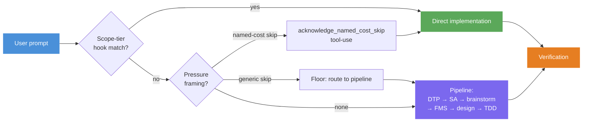
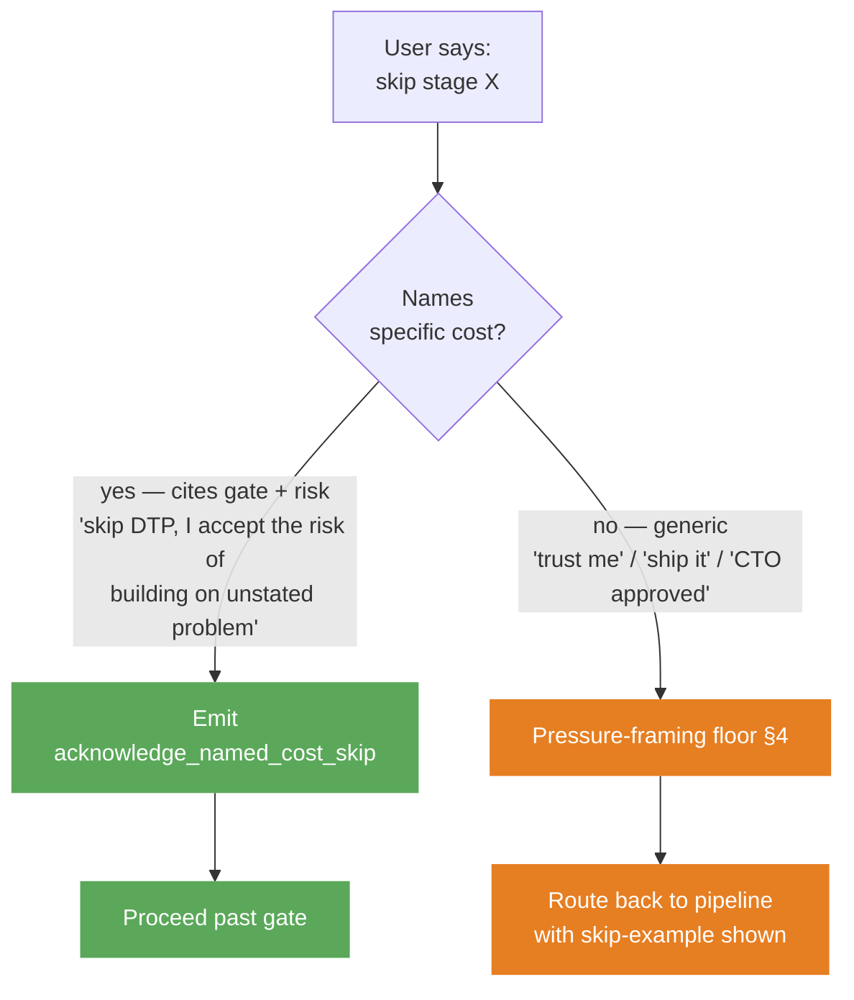
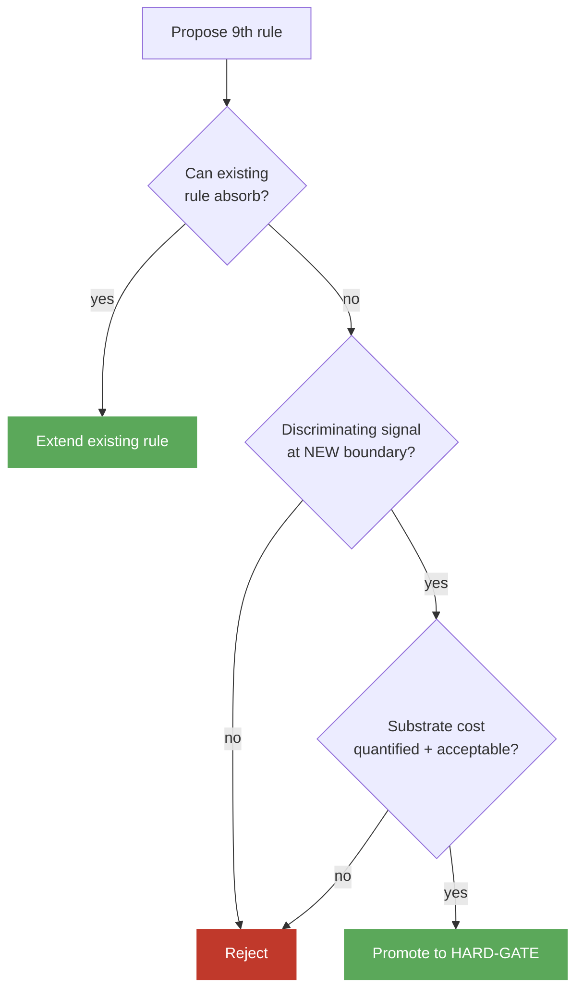

# Mental Model

When you first install Claude Code, it has some bad habits. It jumps straight to writing code. It picks an approach without showing other options. It says "this should work" without checking. And it tends to agree with you — even when you are wrong.

This repo fixes those habits. The fix is a workflow that makes Claude pause at the right moments. It also adds rules that make those pauses hard to skip by accident.

Eight ideas make the fix work. This doc walks through all eight. Read it once before you change any rule, skill, or eval file. After you finish, you should be able to open any rule file and tell which idea it belongs to.

## How a prompt moves through the system

The diagram below shows the path every prompt takes. The rest of the doc is a tour of the boxes:

The tour starts with the parts you use every day. It ends with the parts that keep the daily parts from breaking over time.

## 1. The pipeline — the path most prompts take

*You will see this when you ask Claude to build, change, or design something real.*

When a prompt asks for real work, Claude walks through seven steps in order:

**DTP** (Define The Problem) → **SA** (Systems Analysis) → **Brainstorming** → **FMS** (Fat Marker Sketch) → **Detailed Design** → **TDD** → **Verification**

Each step exists because Claude tends to skip it. DTP makes Claude name who has the problem and what is at stake. SA makes Claude check what else the change will touch. Brainstorming makes Claude show two or three options with the trade-offs. FMS makes Claude sketch the shape of the change before doing the detail work. (Refactors die quiet deaths when the shape is wrong.) TDD makes Claude write a test that fails first. Verification makes Claude run tests and a type-check before saying "done."

These steps are HARD-GATEs. That means Claude cannot move past one until it makes the artifact that step asks for: a problem statement, a list of things the change will touch, a table of options, a sketch, or a test output. Claude also says out loud which step it is on, so you can see the path it took.

Canonical source: [`rules/planning-pipeline.md`](../rules/planning-pipeline.md).

## 2. Scope-tier routing — the fast lane

*You will see this on small jobs: typo fixes, single-file edits, docs-only changes.*

Most prompts are small. Forcing every typo fix through DTP would be a waste. So there is a fast lane.

A hook (`hooks/scope-tier-memory-check.sh`) runs on every prompt. It checks the prompt against saved memories like "trivial mechanical changes skip DTP/SA/brainstorm/FMS." If it finds a match, it adds a `SCOPE-TIER MATCH:` note to the prompt. Claude reads the note, says one line about it, and jumps to implementation.

The fast lane has two layers. The hook runs first (Layer 1). If the hook misses, the pressure-framing floor (Layer 2, see §3 and §4) takes over. If both miss, Claude uses the full pipeline. There is also one off-switch for both layers: the `DISABLE_PRESSURE_FLOOR` file. Drop it in the right folder and both layers stop firing. Use it only if a hook misfires badly.

Even on the fast lane, two things still apply: per-step verify checks and the end-of-work verification gate. The discipline gets shorter. It does not go away.

Canonical source: [`rules/pressure-framing-floor.md#scope-tier-memory-check`](../rules/pressure-framing-floor.md#scope-tier-memory-check).

## 3. Skip contracts — when you really want to skip a step

*You will see this when you want to bypass a gate the pipeline is enforcing.*

Sometimes the hook misses and a step really is in the way. Maybe you have already done the work in your head. The skip contract sets the rules for when a bypass counts:

A real skip names two things: the gate by name AND the risk you accept. For example: "skip DTP, I accept the risk of building on a problem we have not named." Vague phrases like "trust me," "I accept the trade-off," or "ship it" do not count. They fall through to the floor.

Time pressure does not count either. "Demo in ten minutes" or "ship by Friday" make the gate more important, not less. A rushed answer that nobody checks is the most expensive answer to land.

Canonical source: [`rules/skip-contract.md`](../rules/skip-contract.md).

## 4. Pressure framing — what the floor catches

*You will see this when a vague skip gets caught and routed back to the pipeline.*

When a skip does not name a cost, the floor reads the phrasing and sorts it into one of five buckets. The buckets match the idea behind the words, not the exact words:

- **Authority** — "CTO approved," "legal signed off"
- **Sunk cost** — "already committed," "decision is made"
- **Exhaustion** — "I'm tired," "just give me code"
- **Deadline** — "ship by Friday"
- **Stated-next-step** — "skip DTP and brainstorm X"

Each one is a sign that the user wants to move faster. None of them is enough to skip a gate on its own. At most they let Claude use a shorter version of DTP (Expert Fast-Track) that takes thirty seconds instead of five minutes.

The floor itself is hard to bypass. The only off-switch is the `DISABLE_PRESSURE_FLOOR` file. When that file is in place, Claude prints a banner the first time the bypass fires in a session, so you can see it is on.

One detail worth knowing: the floor lives in the rules layer, not inside DTP. A skill cannot catch the moment when it fails to load. So the front door has to sit one layer up.

Canonical source: [`rules/pressure-framing-floor.md`](../rules/pressure-framing-floor.md).

## 5. Emission contract — naming the cost is not enough

*You will see this any time a skip is honored. Claude's next move must be a specific tool call.*

Naming the cost is the first step. It is not the last. Words drift. They get reworded, shortened, or lost. So when a skip is good, Claude MUST call an MCP tool (`acknowledge_named_cost_skip`) before moving on. The call carries the gate name and the exact words you used. The tool call IS how Claude honors the skip.

This sounds like extra work, but it solves a real problem. A tool call shows up in the record exactly once. It has exact data. Anyone — or any system — can check it later without asking Claude what happened. The system enforces the rule. Claude cannot talk around it. In a long-running loop there are only four ways out of a gate: pass, mechanical carve-out, sentinel bypass, or hard-block-and-ask. There is no fifth way.

Canonical source: [`rules/skip-contract.md#emission-contract`](../rules/skip-contract.md#emission-contract).

## 6. HARD-GATE cap — keeping the rules layer small

*You will see this if you ever try to add a ninth HARD-GATE rule.*

All the pieces above only work if there are not too many rules. Every rule runs on every prompt. Each one adds to the context Claude has to read first. Over time the rules themselves become the slowdown. Worse, new rules often cover the same ground as old ones. They burn budget without adding anything new.

To stop that, the repo caps HARD-GATE rules at eight. A ninth rule has to pass three checks:

The current eight: planning-pipeline, think-before-coding, fat-marker-sketch, goal-driven, verification, pr-validation, disagreement, memory-discipline, execution-mode. (`tdd-pragmatic` is soft guidance. It is not a HARD-GATE.)

Canonical source: [`rules/GOVERNANCE.md#hard-gate-cap`](../rules/GOVERNANCE.md#hard-gate-cap).

## 7. Discriminating signals — how a rule earns its spot

*You will see this when you write or change a rule's eval suite.*

The "discriminating signal" check in §6 is the heart of how rules earn their spot. A rule passes only if its eval can show two things: the bad behavior shows up when the rule is OFF, and the good behavior shows up when the rule is ON. The test has to happen at THIS rule's edge, not somewhere else in the rules layer.

Without that, adding a rule is theater. Two rules with the same job can both pass when only one of them is loaded. The eval cannot tell which one did the work.

The same idea now applies one level down, at the skill layer ([ADR #0019](../adrs/0019-skill-eval-discriminating-signal-discipline.md), checked by validate Phase 1r). Every `skills/<name>/evals/evals.json` needs at least one `"tier": "required"` assertion. That is the skill's own discriminating signal.

Canonical sources: [ADR #0005](../adrs/0005-behavioral-adr-promotion-requires-discriminating-signal.md), [ADR #0019](../adrs/0019-skill-eval-discriminating-signal-discipline.md).

## 8. Anchor pattern — keeping links between rules from breaking

*You will see this when you change the headings in a rule file or follow a deep link between rules.*

Rules quote each other often. For example, `pr-validation.md` deep-links into `skip-contract.md#emission-contract`. GitHub builds the link target from the heading text. So if someone renames `## Emission contract — MANDATORY` to `## Emission contract`, every deep link to the old name silently breaks. Nothing yells at you when it happens.

The fix is to add an HTML anchor like `` above each cited section. That id does not change when the heading text does. Three validate phases watch the graph: **Phase 1j** (every promised anchor is still there), **Phase 1k** (every link points to a real anchor), and **Phase 1l** (no one quietly deleted a delegate paragraph). Together they catch the silent breaks.

Canonical source: [`rules/GOVERNANCE.md#stable-anchor-pattern`](../rules/GOVERNANCE.md).

---

## Where to go next

Pick by what you are about to do:

- **Editing a rule file** → [`rules/GOVERNANCE.md`](../rules/GOVERNANCE.md) for the cap policy and how to retire a rule, plus [`docs/contributing.md`](contributing.md) for the contributor workflow.
- **Adding a skill or rule eval** → §7 above, then [ADR #0005](../adrs/0005-behavioral-adr-promotion-requires-discriminating-signal.md) and [ADR #0019](../adrs/0019-skill-eval-discriminating-signal-discipline.md).
- **Touching hooks or runtime ops** → [`docs/operations.md`](operations.md) for bypass flags and hook setup.
- **Just browsing the inventory** → [`docs/catalog.md`](catalog.md).
- **Want the decision history** → [`adrs/`](../adrs/). Every concept above traces to one or more ADRs.
