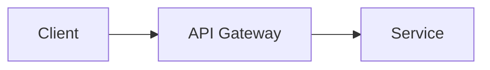

# `/present` Skill Implementation Plan

> **For agentic workers:** REQUIRED SUB-SKILL: Use superpowers:subagent-driven-development (recommended) or superpowers:executing-plans to implement this plan task-by-task. Steps use checkbox (`- [ ]`) syntax for tracking.

**Goal:** Build a `/present` Claude Code skill that turns a brief, notes, or an existing deck into a professional Slidev presentation — with live preview, iterative refinement via conversation, and PDF/PPTX export.

**Architecture:** A single `skills/present/SKILL.md` file containing Claude instructions. The skill follows the same pattern as `skills/adr/` and `skills/tech-radar/`. It is symlinked globally via `install.fish`. No code, no dependencies added to this repo — Slidev runs via `bunx` in the user's presentation directories.

**Tech Stack:** Slidev, Bun (`bunx slidev`), Mermaid (built-in to Slidev), Chart.js (built-in to Slidev), Shiki (syntax highlighting, built-in).

---

### Task 1: Create `skills/present/SKILL.md`

**Files:**
- Create: `skills/present/SKILL.md`

- [ ] **Step 1: Create the skill directory and file**

```fish
mkdir -p skills/present
```

Then create `skills/present/SKILL.md` with this exact content:

````markdown
---
name: present
description: Create professional Slidev presentations from a brief, draft, or existing slides. Use when the user says /present, "create a presentation", "make slides", "build a deck", or wants to create or update a presentation.
---

# Present: Professional Presentation Workflow

Creates professional presentations using Slidev + Bun. Source-controllable Markdown → live preview → PDF/PPTX export.

**Announce at start:** "I'm using the present skill to help you build a presentation."

## Prerequisites Check

Before anything else, verify Slidev is available:

```fish
bunx slidev --version
```

If this fails, tell the user:
> "Slidev isn't installed. Run: `bun add -g @slidev/cli` then try again."

Stop here if installation fails.

## Entry Point Detection

Determine how the user invoked the skill:

| Input | Mode |
|---|---|
| A brief or topic string | **Generate mode** — Claude drives content from scratch |
| Pasted notes, doc, or outline | **Assist mode** — Claude restructures provided content |
| A path to `slides.md` | **Revise mode** — Claude reads and modifies existing deck |

If unclear, ask: "Are you starting from scratch, working from existing notes, or revising a deck you already have?"

## Step 1: Audience & Intake

Ask these questions **one at a time**:

1. **Audience type** — choose one or more:
   - A) Executive / leadership
   - B) Technical / engineering
   - C) Client / external

2. **Key message** — "What's the one thing the audience must walk away knowing?"

3. **Length** — How many slides approximately? (Or: how much time do you have?)

4. **Must-include elements** — Any specific data, diagrams, or constraints to include?

In **Revise mode**, skip intake and ask instead: "What needs to change — audience shift, new data, restructure, or something else?"

## Step 2: Narrative Outline

Generate a slide-by-slide outline based on the intake. Apply audience content rules:

| Audience | Content rules |
|---|---|
| Executive | Max 3 bullets/slide, lead with business impact, use `fact` layout for key metrics |
| Technical | Code blocks welcome, architecture diagrams encouraged, higher density allowed |
| Client/external | Clean visuals, minimal jargon, strong narrative arc with clear call-to-action |

Present the outline to the user. Ask: "Does this narrative arc look right? Any slides to add, remove, or reorder?"

Iterate on the outline until the user approves it. Do not write Markdown until the outline is approved.

## Step 3: Generate slides.md

Once the outline is approved, write the presentation to:

```
~/presentations/<slug>/slides.md
```

Where `<slug>` is a kebab-case version of the presentation title (e.g., "Q3 Engineering Roadmap" → `q3-engineering-roadmap`).

### Default Frontmatter

Every presentation starts with:

```yaml
---
theme: default
colorSchema: dark
highlighter: shiki
lineNumbers: false
fonts:
  sans: 'Inter'
  mono: 'JetBrains Mono'
transition: slide-left
---
```

Note: use `colorSchema: light` when the context requires it (printed handouts, bright projection rooms).

### Layouts

| Layout | When to use |
|---|---|
| `cover` | Title slide — large headline, subtitle, date |
| `default` | General content — text, bullets |
| `two-cols` | Side-by-side comparisons |
| `center` | Key statements, quotes, call-to-action |
| `fact` | Single large stat or highlight |

### Slide Separator

Separate slides with `---` on its own line. To set a layout for a specific slide:

```markdown
---
layout: fact
---

# 47%
Reduction in time-to-deploy after migrating to the new pipeline
```

### Diagram Blocks

Use the right block for each diagram type:

**Mermaid (flow, sequence, architecture):**



**Chart.js (data visualizations):**

```chart
type: bar
data:
  labels: [Q1, Q2, Q3, Q4]
  datasets:
    - label: Revenue ($M)
      data: [1.2, 1.8, 2.1, 2.4]
```

**Code blocks (technical slides) — syntax highlighted via Shiki:**

```typescript
const result = await fetch('/api/data')
const data = await result.json()
```

## Step 4: Live Preview

After writing slides.md, tell the user:

> "Slides written to `~/presentations/<slug>/slides.md`. Start the preview with:"
>
> ```fish
> cd ~/presentations/<slug> && bunx slidev slides.md
> ```
>
> "This opens at http://localhost:3030 and hot-reloads on every save."

## Step 5: Iteration

Stay in the conversation for revision requests. Edit `slides.md` directly — the user never needs to touch the file manually.

Handle requests like:
- "Make slide 3 punchier" → rewrite that slide's content
- "Add a diagram showing the auth flow" → insert the Mermaid block on the correct slide
- "Restructure slides 4–7, the narrative is off" → rewrite that section
- "Switch to light mode" → change `colorSchema: dark` to `colorSchema: light`
- "Add a data chart for Q3 metrics" → insert a Chart.js block with the provided data

After each edit, confirm what changed: "Updated slide 3 — shortened to 2 bullets and sharpened the headline."

## Step 6: Export

When the user is ready to export:

```fish
# PDF
cd ~/presentations/<slug> && bunx slidev export slides.md --format pdf

# PowerPoint
cd ~/presentations/<slug> && bunx slidev export slides.md --format pptx
```

Both files land in `~/presentations/<slug>/`.

### Export Troubleshooting

If export fails (Puppeteer/Chromium not available):

1. Try: `bunx slidev export slides.md --format pdf --with-clicks`
2. If still failing: open `http://localhost:3030` and use browser print-to-PDF as fallback
3. For PPTX: export requires Chromium. If unavailable, export PDF first and note the PPTX limitation.

Note: Slidev's PPTX export embeds slide images — the output is not text-editable in PowerPoint. This is acceptable for presentation use; if the recipient needs to edit the deck, deliver PDF instead.

## Source Control

Each presentation directory is independently git-trackable:

```fish
cd ~/presentations/<slug>
git init
git add slides.md
git commit -m "Initial deck: <title>"
```

`slides.pdf` and `slides.pptx` should be gitignored (generated artifacts). The `slides.md` file is the source of truth.
````

- [ ] **Step 2: Verify the file was created**

```fish
cat skills/present/SKILL.md | head -5
```

Expected output:
```
---
name: present
description: Create professional Slidev presentations from a brief, draft, or existing slides. ...
---
```

- [ ] **Step 3: Commit the skill file**

```fish
git add skills/present/SKILL.md
git commit -m "Add /present skill (Slidev + Bun)"
```

Expected: commit succeeds, 1 file changed.

---

### Task 2: Install Globally

**Files:**
- Run: `install.fish` (no changes to the script itself)

- [ ] **Step 1: Run the install script**

```fish
fish install.fish
```

Expected output includes:
```
✓ skills/present → ~/.claude/skills/present
```

- [ ] **Step 2: Verify the symlink was created**

```fish
ls -la ~/.claude/skills/present
```

Expected: a symlink pointing to the repo's `skills/present/` directory.

- [ ] **Step 3: Verify the skill is discoverable**

In a new Claude Code session (any directory), check that `/present` appears in the available skills list. The skill should be listed with its description: "Create professional Slidev presentations from a brief, draft, or existing slides."

---

### Task 3: Smoke Test — Generate Mode

**Files:**
- Generated: `~/presentations/test-deck/slides.md`

- [ ] **Step 1: Invoke the skill with a minimal brief**

In a Claude Code session, run:

```
/present "Test deck for smoke testing"
```

- [ ] **Step 2: Complete the intake**

When Claude asks intake questions, provide:
- Audience: B) Technical / engineering
- Key message: "This is a smoke test"
- Length: 3 slides
- Must-include: none

- [ ] **Step 3: Approve the outline**

When Claude presents a 3-slide outline, respond "looks good" to proceed.

- [ ] **Step 4: Verify slides.md was created**

```fish
cat ~/presentations/test-deck/slides.md
```

Verify:
- File exists
- Starts with the correct frontmatter (`theme: default`, `colorSchema: dark`, etc.)
- Contains at least a `cover` layout slide and 2 content slides
- Slides are separated by `---`

- [ ] **Step 5: Verify live preview starts**

```fish
cd ~/presentations/test-deck && bunx slidev slides.md
```

Expected: dev server starts, browser opens at `http://localhost:3030`, slides render without errors. Stop the server with `Ctrl+C` after confirming.

---

### Task 4: Smoke Test — Export

**Files:**
- Generated: `~/presentations/test-deck/slides.pdf`
- Generated: `~/presentations/test-deck/slides.pptx`

- [ ] **Step 1: Export to PDF**

```fish
cd ~/presentations/test-deck && bunx slidev export slides.md --format pdf
```

Expected: command completes without error, `slides.pdf` appears in the directory.

```fish
ls -lh ~/presentations/test-deck/slides.pdf
```

Expected: file exists with non-zero size.

- [ ] **Step 2: Export to PPTX**

```fish
cd ~/presentations/test-deck && bunx slidev export slides.md --format pptx
```

Expected: command completes without error, `slides.pptx` appears in the directory.

```fish
ls -lh ~/presentations/test-deck/slides.pptx
```

Expected: file exists with non-zero size.

- [ ] **Step 3: Open and spot-check the PDF**

```fish
open ~/presentations/test-deck/slides.pdf
```

Verify: PDF opens, slide count matches the number of slides in `slides.md`, dark theme renders correctly.

- [ ] **Step 4: Clean up test artifacts**

```fish
rm -rf ~/presentations/test-deck
```

- [ ] **Step 5: Close the GitHub issue**

```fish
gh issue close 26 --comment "Implemented as /present skill in skills/present/SKILL.md. Slidev + Bun, dark theme default, PDF + PPTX export, conversational iteration. Installed globally via install.fish."
```
