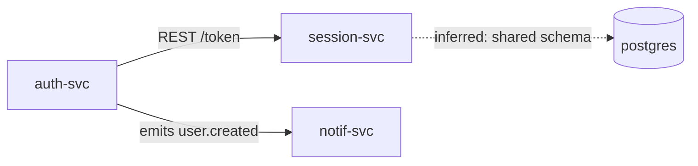
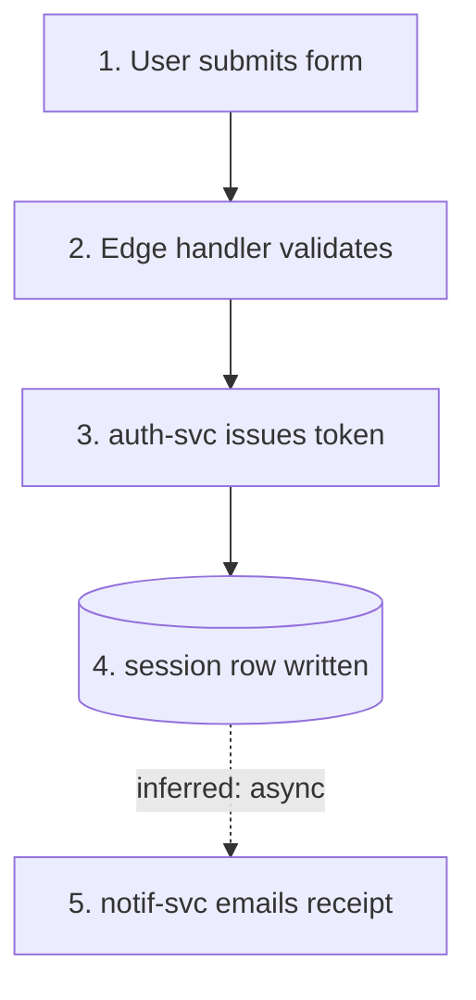

# Output Format — `/architecture-overview` 4-File Bundle

Every bundle ships four files, all sharing the same frontmatter, all italic-marked
inferred claims, plain-text-only on code-grounded claims.

## Common Frontmatter

```yaml
---
generated_by: /architecture-overview
generated_at: 2026-05-05T16:45:00Z
repos:
  - name: billing-service
    path: ~/work/billing
    head_sha: a1b2c3d4e5f6
language_ref: ../../references/architecture-language.md
---

> *Italics = inferred. Plain = code-grounded.*
```

> The `language_ref` path is relative to the OUTPUT file's parent directory,
> not the repo root. Adjust per output location depth. See `SKILL.md` Step 8
> for full guidance.

## File 1 — `inventory.md`

Per-repo entry. Each entry uses LANGUAGE.md vocab:

```markdown
## <repo-name>

**Module**: <one-line synthesis of what this module is>.
**Interface**: <surface visible to callers — protocol, paths, events>.
**Implementation**: <stack + LOC + entry point>.

**Signals**:
- Test surface: <test file count + hasTestDir>
- Last commit: <date> (<N>d ago)
- Manifests: <list>
- TODO/FIXME: <count>

*Likely brittleness*: <observation paragraph, italic>.
```

## File 2 — `dependencies.md`

Edges between modules. Cross-repo edges resolved when a manifest dep matches another
repo's package name.

```markdown
## <source> → <target>
**Seam**: <where the call lives — file path, protocol>.
**Adapter**: <concrete client/handler>.
**Observed via**: <evidence — import statement, env var>.
```

Italic the entire entry when evidence is inferred (e.g., env var implies dependency
but no client found).

### Diagram — `graph LR`

Emit a mermaid block alongside the prose. Nodes are Modules (LANGUAGE.md vocab —
not "service" / "component"). Use repo name as node ID. Edges are Seams; edge label
names the Adapter (REST path, event topic, shared schema) when known.



- **Solid `-->`** = observed (manifest dep, env var, import, code reference).
- **Dashed `-.->`** = inferred. Edge label prefixed `inferred:` to carry italic discipline.
- **Datastores** = `[(name)]` cylinder shape.
- **Cap**: ~12 nodes per block. Larger landscapes split per domain
  (`### Domain: Auth`, `### Domain: Billing`), one mermaid block each.

## File 3 — `data-flow.md`

Data lifecycle. Numbered steps. Each step `[observed: <evidence>]` or italicized when
inferred.

### Diagram — `flowchart TD`

Emit a mermaid block alongside the prose. Nodes mirror the numbered prose
enumeration. Same observed/inferred convention on edges.



- **Solid `-->`** = observed.
- **Dashed `-.->`** = inferred. Edge label prefixed `inferred:`.
- **Datastore writes** = `[(text)]` cylinder shape.
- **Cap**: ~12 nodes per block. Larger lifecycles split per flow
  (`### Flow: Signup`, `### Flow: Checkout`), one mermaid block each.

## File 4 — `integrations.md`

External SaaS / APIs. Per-integration: which repos, evidence, cost / lock-in note.
