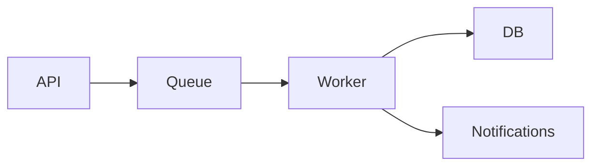

# Fat Marker Sketch

A fat marker sketch is a crude structural drawing — as if you grabbed a thick Sharpie
and sketched on a whiteboard. The thick marker physically prevents fine detail. That's
the point: it forces the conversation to stay on structure and components, not pixels.

**See `assets/example-fat-marker-sketch.jpg` for a visual reference of the target fidelity.**
That image IS the standard — crude boxes, cross-hatching for placeholder content, no
styling, no detail. Match that level when producing sketches.

The sketch answers two questions:
1. **What are the major components and how do they relate?** — structural regions,
   boxes, connections. For UI: screen layout. For systems: what talks to what.
2. **What happens when the system is exercised?** — the happy-path flow. For UI:
   tap this -> see that. For backends: request enters here -> passes through these
   -> result lands there.

It does NOT answer: what things look like in detail, how they're styled, what edge
cases exist, or how errors are handled.

The right fidelity level is: **enough to evaluate the user journey, not enough to
implement from.** You should be able to look at the sketch and say "the flow is wrong"
or "screen 3 shouldn't exist" — but NOT be able to build it without further design.

---

## Step 1: Choose the Format

Pick the format that fits the feature:

- **UI / output feature** — show the key screens side by side as a journey. Each screen
  gets a numbered title, 3-5 boxes inside showing regions, and labeled actions in
  brackets. Include a separate FLOW section mapping screen-to-screen connections as
  plain text (e.g., `Welcome -> Questions -> Your Plan -> [Activate] -> Dashboard`).
- **Process / workflow feature** — a simple numbered flow or rough state diagram showing
  the steps the user goes through. Happy path only.
- **CLI / command feature** — the command invocation and a rough example of output.
  Fake data is fine.
- **System / integration feature** — a simple Mermaid diagram (≤6 nodes, no conditionals,
  no styling directives). `graph LR; A-->B-->C` is the right level.

### Rendering

Default to **HTML**. Use `assets/sketch-template.html` as the starting scaffold —
duplicate the screen `div` for each step in the journey, fill in names/regions/actions.

Only fall back to ASCII (markdown code block with `+`, `-`, `|` box characters) if the
user explicitly requests it or the environment cannot render HTML.

<HARD-GATE>
A fat marker sketch is a VISUAL artifact, not a text artifact. When rendering as HTML:

- Start from `assets/sketch-template.html`
- Include Google Font: `<link href="https://fonts.googleapis.com/css2?family=Permanent+Marker&display=swap" rel="stylesheet">`
- The root element MUST set `background: #fff; color: #000; font-family: 'Permanent Marker', cursive; font-size: 20px;`
- Use `border: 4px solid #000` for screen frames (fat marker = thick lines)
- Use `border: 3px solid #000` for region boxes within screens
- Use uneven `border-radius` values (e.g., `2px 5px 4px 3px`) on every box -- vary
  the values so no two boxes have the same radius. This creates a hand-drawn feel.
- Do NOT inherit the host page's theme -- the sketch must look like black marker on white paper

Never output the sketch as plain prose or an unstyled text list. If it doesn't have
visible boxes/borders around screens and regions, it's not a sketch -- it's notes.

See `assets/example-ui-sketch.html` for a complete example of the right output.
</HARD-GATE>

---

## Step 2: Produce the Sketch

Apply these fidelity rules regardless of format:

- **Black on white** — white background, black text and strokes. Like marker on paper.
  Every rendered sketch must set an explicit white background and black text on the
  root element. Do NOT rely on the host page's theme.
- **Journey-focused** — show the full user journey across screens or steps, not a
  single screen in isolation. Number each screen/step.
- **Structural boxes** — each screen is a thick-bordered (4px) rectangle. Regions
  within screens are 3px-bordered rectangles. Use uneven border-radius on every box
  so they look hand-drawn. The boxes ARE the sketch — without them you just have a
  text list.
- **Representative content** — include enough text to understand what each region DOES,
  not just what it IS. "Q: How often paid?" is good — it tells you the screen is a
  guided questionnaire. "Goal Card" is too abstract. But don't write full copy or
  real data for every field.
- **Explicit actions** — label every user action in brackets: [Get Started], [Next],
  [Activate], [+ Add Goal]. These make the flow traceable.
- **No styling** — no colors, no icons, no shadows, no rounded corners with specific
  radii. Plain rectangles and lines. Crude block-character progress bars are fine
  for showing proportional state.
- **ASCII-safe characters only** — use `->` for arrows, `[x]` for checked, `[ ]` for
  unchecked. Do NOT use Unicode arrows (->), checkmarks (✓), or other special characters
  — they render as garbled text in minimal HTML viewers.
- **Show relationships** — how components connect (tap this -> see that, service A calls
  service B). For UI, include a FLOW section mapping connections as plain text.

### Self-check before presenting

Read `references/self-check.md` and verify the sketch passes all checks before
presenting it.

### Properties

The sketch should:

- Fit in one screen (all screens of the journey visible together)
- Take under 2 minutes to produce
- Be disposable — it's a conversation tool, not a deliverable
- Show the **full journey** across screens/steps, not a single screen in detail
- Include representative content and explicit actions
- Omit edge cases, error states, and configuration options

---

## Step 3: Validate

Ask three focused questions:

> "Before we go deeper — three quick checks:
> 1. **Scope**: Is anything here that shouldn't be, or missing something that should?
> 2. **Components**: Do these pieces feel right, or should something be split/merged?
> 3. **Flow**: Does the happy path make sense?"

- If the user confirms: proceed to detailed design sections
- If the user pushes back: revise the sketch or reconsider the approach (see Backtracking)

The sketch is NOT saved to disk or included in the spec. It's a conversation artifact
that prevents expensive design rework.

---

## Backtracking

When the sketch reveals a problem, name the backtrack explicitly and go to the
right level:

- **Wrong shape, right approach**: Revise the sketch. Do NOT re-run decomposition.
  "The sketch shows [problem]. Let me redraw with [adjustment]."
- **Wrong approach**: Return to the **Solution Design** stage in the planning pipeline
  with the same decomposition intact. Present remaining approaches or propose new ones
  informed by what the sketch revealed. "The sketch revealed [X] doesn't work
  because [Y]. Let's revisit the approaches."
- **Wrong problem framing**: Rare, but if the sketch surfaces a fundamental
  misunderstanding, return to the **Problem Definition** stage and re-validate.
  "This sketch made me realize the problem might actually be [Z], not [original].
  Let's go back to the core problem."

Always state what triggered the backtrack, where you're going, and why.

---

## Examples

### UI Example

See `assets/example-ui-sketch.html` for a complete rendered example of a guided
savings feature. It shows four screens (Welcome -> Guided Q's -> Your Plan -> Dashboard)
with representative content, bracketed actions, and a FLOW section.

**Too detailed** (wrong):
A single-screen wireframe with full sample data for every field, styled progress bars,
and dollar amounts — but no journey context. You can't evaluate the user experience
from a single screen.

**Too abstract** (wrong):
`[Header] [Status badges] [Goals list] [Paycheck breakdown] [Recommendation]`
— just a parts list. You can't evaluate the flow or whether the experience makes sense.

**Right**: The example in `assets/example-ui-sketch.html` — four screens showing the
full journey. Each has 3-5 elements with enough content to understand what the screen
DOES. Actions in brackets. A FLOW section mapping connections. No styling, no full
copy, no pixel decisions — but enough to ask "is this the right experience?"

### System Example



```
FLOW
Request -> API validates -> Queue buffers -> Worker processes -> DB stores
Worker -> Notification service (async, on completion)
Failure -> Queue retries 3x -> Dead letter -> Alert
```

Six nodes. One diagram. A flow section showing the happy path and one failure mode.
Enough to ask "should notifications be sync or async?" — but not enough to implement from.
