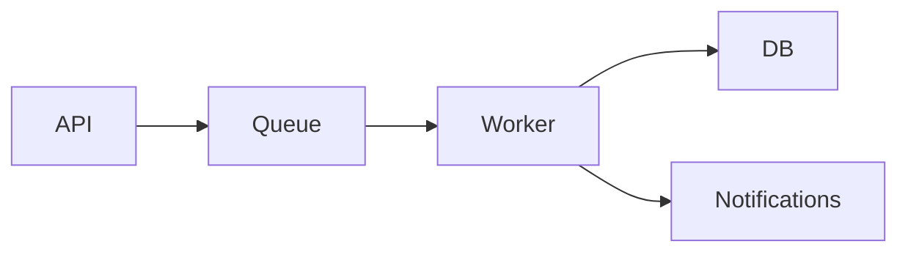

# Fat Marker Sketch

A fat marker sketch is a crude structural drawing — as if you grabbed a thick Sharpie
and sketched on a whiteboard. The thick marker physically prevents fine detail. That's
the point: it forces the conversation to stay on structure and components, not pixels.

Reference: https://domhabersack.com/blog/fat-marker-sketches

The sketch answers two questions:
1. **What are the major components and how do they relate?** — structural regions,
   boxes, connections. For UI: screen layout. For systems: what talks to what.
2. **What happens when the system is exercised?** — the happy-path flow. For UI:
   tap this → see that. For backends: request enters here → passes through these
   → result lands there.

It does NOT answer: what things look like in detail, how they're styled, what edge
cases exist, or how errors are handled.

The right fidelity level is: **enough to evaluate the user journey, not enough to
implement from.** You should be able to look at the sketch and say "the flow is wrong"
or "screen 3 shouldn't exist" — but NOT be able to build it without further design.

---

## Step 1: Determine Rendering Format

If you haven't established the rendering format in this conversation, ask once:

> "Should I render the sketch as HTML (for a visual viewer) or ASCII (for the terminal)?"

Default to HTML if a visual companion has been used earlier in the conversation.
Do not ask again after the first sketch — reuse the same format.

### HTML rendering (preferred)

<HARD-GATE>
A fat marker sketch is a VISUAL artifact, not a text artifact. When rendering as HTML:

- Use `div` elements with `border: 2px solid #000` for screen frames and region boxes
- Use `flexbox` or `grid` to lay screens side by side
- The root element MUST set `background: #fff; color: #000; font-family: monospace;`
- Do NOT inherit the host page's theme — dark-themed wrappers make sketches unreadable
- The sketch must look like black marker on white paper

Never output the sketch as plain prose or an unstyled text list. If it doesn't have
visible boxes/borders around screens and regions, it's not a sketch — it's notes.
</HARD-GATE>

### ASCII fallback (CLI only)

Use a markdown code block with ASCII box characters (`+`, `-`, `|`) to form screen
frames and regions. This is the ONLY case where a code block is acceptable.

---

## Step 2: Choose the Format

Pick the format that fits the feature:

- **UI / output feature** — show the key screens side by side as a journey. Each screen
  gets a numbered title, 3-5 boxes inside showing regions, and labeled actions in
  brackets. Include a separate FLOW section mapping screen-to-screen connections as
  plain text (e.g., `Welcome → Questions → Your Plan → [Activate] → Dashboard`).
- **Process / workflow feature** — a simple numbered flow or rough state diagram showing
  the steps the user goes through. Happy path only.
- **CLI / command feature** — the command invocation and a rough example of output.
  Fake data is fine.
- **System / integration feature** — a simple Mermaid diagram (≤6 nodes, no conditionals,
  no styling directives). `graph LR; A-->B-->C` is the right level.

---

## Step 3: Produce the Sketch

Apply these fidelity rules regardless of format:

- **Black on white** — white background, black text and strokes. Like marker on paper.
  Every rendered sketch must set an explicit white background and black text on the
  root element. Do NOT rely on the host page's theme.
- **Journey-focused** — show the full user journey across screens or steps, not a
  single screen in isolation. Number each screen/step.
- **Structural boxes** — each screen is a bordered rectangle. Regions within screens
  are smaller bordered rectangles or dividers. The boxes ARE the sketch — without
  them you just have a text list.
- **Representative content** — include enough text to understand what each region DOES,
  not just what it IS. "Q: How often paid?" is good — it tells you the screen is a
  guided questionnaire. "Goal Card" is too abstract. But don't write full copy or
  real data for every field.
- **Explicit actions** — label every user action in brackets: [Get Started], [Next],
  [Activate], [+ Add Goal]. These make the flow traceable.
- **No styling** — no colors, no icons, no shadows, no rounded corners with specific
  radii. Plain rectangles and lines. Crude block-character progress bars are fine
  for showing proportional state.
- **Show relationships** — how components connect (tap this → see that, service A calls
  service B). For UI, include a FLOW section mapping connections as plain text.

### Self-check before presenting

If you catch yourself doing any of these, STOP and simplify:

Too detailed:
- Adding colors, gradients, or fills beyond black/white/gray
- Styling buttons, inputs, or interactive elements with shadows or radii
- Building detailed flow diagrams with multiple conditional branches
- Filling every field with realistic sample data instead of representative content

Not a sketch (too low fidelity):
- Outputting a plain text list or prose instead of a visual with boxes/borders
- Using a markdown code block when the user chose HTML rendering
- Showing only a single screen instead of the multi-screen journey
- Inheriting a dark theme instead of setting explicit white background
- Missing the FLOW section that maps screen-to-screen connections

The sketch should look like something drawn in 2 minutes on a whiteboard — bordered
screen frames, labeled regions inside them, bracketed actions, and a flow summary.

### Properties

The sketch should:

- Fit in one screen (all screens of the journey visible together)
- Take under 2 minutes to produce
- Be disposable — it's a conversation tool, not a deliverable
- Show the **full journey** across screens/steps, not a single screen in detail
- Include representative content and explicit actions
- Omit edge cases, error states, and configuration options

---

## Step 4: Validate

Ask three focused questions:

> "Before we go deeper — three quick checks:
> 1. **Scope**: Is anything here that shouldn't be, or missing something that should?
> 2. **Components**: Do these pieces feel right, or should something be split/merged?
> 3. **Flow**: Does the happy path make sense?"

- If the user confirms: proceed to detailed design sections
- If the user pushes back: revise the sketch or reconsider the approach (see Backtracking)

The sketch is NOT saved to disk or included in the spec. It's a conversation artifact
that prevents expensive design rework.

---

## Backtracking

When the sketch reveals a problem, name the backtrack explicitly and go to the
right level:

- **Wrong shape, right approach**: Revise the sketch. Do NOT re-run decomposition.
  "The sketch shows [problem]. Let me redraw with [adjustment]."
- **Wrong approach**: Return to step 6 (explore solution space) in planning.md with
  the same decomposition intact. Present remaining approaches or propose new ones
  informed by what the sketch revealed. "The sketch revealed [X] doesn't work
  because [Y]. Let's revisit the approaches."
- **Wrong problem framing**: Rare, but if the sketch surfaces a fundamental
  misunderstanding, return to step 2 (define the core problem) and re-validate.
  "This sketch made me realize the problem might actually be [Z], not [original].
  Let's go back to the core problem."

Always state what triggered the backtrack, where you're going, and why.

---

## Examples

Note: these examples use ASCII because this skill file can't render HTML. When
producing the actual sketch, follow the rendering format from Step 1. The ASCII
here represents the *structure*, not the *format*.

### UI Example: Too Detailed vs. Right Level

A guided savings feature. **Wrong** — single-screen wireframe with full data:

```
+--------------------------------------------+
|  Awesome Credit Union — Money Saver        |
+--------------------------------------------+
|  [Bills: All Covered]  [Next pay: Mar 31]  |
|  Goals:                                    |
|  +-- Emergency Fund -------- 60% ------+   |
|  +-- Vacation --------------- 25% ------+  |
|  Last Paycheck Breakdown:                  |
|  +-- Bills -------- $1,200 -------------+  |
|  +-- Savings ------ $400 ---------------+  |
|  [Recommendation: Move to 12-mo CD]       |
+--------------------------------------------+
```

This is a wireframe of one screen. It has full sample data for every field, styled
progress bars, and dollar amounts — but no journey context. You can't evaluate the
user experience from a single screen.

**Also wrong** — too abstract:

```
[Header] [Status badges] [Goals list] [Paycheck breakdown] [Recommendation]
```

This is just a parts list. You can't evaluate the flow or whether the experience
makes sense.

**Right** — multi-screen journey with representative content:

```
1. WELCOME          2. GUIDED Q's       3. YOUR PLAN        4. DASHBOARD
-----------         -------------       ------------        -----------
"Start saving       Q: How often paid?  Safe to save: $/mo  Total saved: $
 smarter"           Q: What goals?      Goal → Product      Goal -- %
                    Q: How flexible?    Schedule: Each pay   ████░░░░░░░
[Get Started]       Q: Monthly income?                      [+ Add Goal]
    ↓               [Next]              [Activate] [Adjust]  [Settings]
                        ↓                    ↓

FLOW
Welcome → Questions → Your Plan → [Activate] → Dashboard
Your Plan → [Adjust] → edit and resubmit
Dashboard → [+ Add Goal] → Questions (new goal only)
Dashboard → tap Goal Card → Goal Detail
```

Four screens showing the full journey. Each has 3-5 elements with enough content
to understand what the screen DOES. Actions in brackets. A FLOW section mapping
connections. No styling, no full copy, no pixel decisions — but enough to ask
"is this the right experience?"

### System Example: Event Pipeline



```
FLOW
Request → API validates → Queue buffers → Worker processes → DB stores
Worker → Notification service (async, on completion)
Failure → Queue retries 3x → Dead letter → Alert
```

Six nodes. One diagram. A flow section showing the happy path and one failure mode.
Enough to ask "should notifications be sync or async?" and "is a dead letter queue
the right retry strategy?" — but not enough to implement from.
