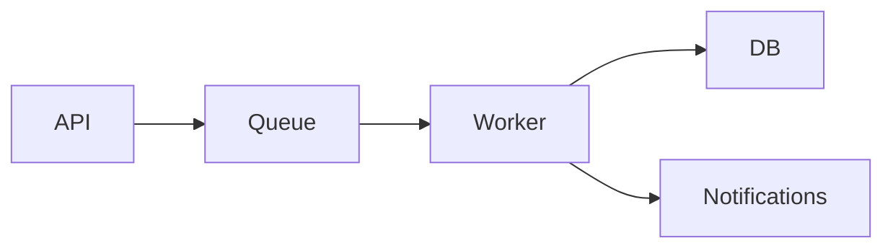

# Examples

Worked examples per archetype. The skill's `SKILL.md` Step 2 fidelity rules apply
across all of them.

## UI Example

See `assets/example-ui-sketch.html` for a complete rendered example of a guided
savings feature (HTML fallback path). It shows four screens
(Welcome -> Guided Q's -> Your Plan -> Dashboard) with representative content,
bracketed actions, and a FLOW section.

**Too detailed** (wrong):
A single-screen wireframe with full sample data for every field, styled progress bars,
and dollar amounts — but no journey context. You can't evaluate the user experience
from a single screen.

**Too abstract** (wrong):
`[Header] [Status badges] [Goals list] [Paycheck breakdown] [Recommendation]`
— just a parts list. You can't evaluate the flow or whether the experience makes sense.

**Right**: The example in `assets/example-ui-sketch.html` — four screens showing the
full journey. Each has 3-5 elements with enough content to understand what the screen
DOES. Actions in brackets. A FLOW section mapping connections. No styling, no full
copy, no pixel decisions — but enough to ask "is this the right experience?"

## Before/After Example

See `assets/example-before-after-sketch.html` for a rendered refactor-shaped sketch
(eval-runner scratch-cwd change). Demonstrates AFTER-dominant visual weight,
strikethrough on removed paths, heavier stroke on added nodes, and a DELTA footer that
names the change so the reader doesn't have to diff two lists. That is the fidelity
bar for the **Before/After diptych** archetype.

## Sequence Example (HTML fallback)

See `assets/example-sequence-sketch.html` for a rendered sequence-shaped sketch
(User → API → Worker → DB checkout flow). HTML fallback rendering for the
**Sequence / swimlane** archetype requires vertical dashed lifelines under each
actor, horizontal message arrows (solid for synchronous calls, dashed with reversed
arrowhead for returns), and activation bars on receiver lifelines. Top-to-bottom
ordering carries the time axis — do NOT render messages as grid cells, since that
loses the explicit "this happens before that" signal that distinguishes a sequence
from a tabular swimlane.

When PARAMETERIZING this template with dynamic actor names or message labels (e.g.,
substituting `USER` with a user-supplied service name), HTML-entity-encode `<`, `>`,
`&`, `"`, and `'` in every substituted string before insertion. The template uses
inline-style `<div>` construction with no escaping discipline of its own; reusing
it as a sketch generator without encoding is a stored-XSS path in any tool that
later renders the result as HTML (browser tab, Preview panel, eval snapshot).

## System Example



```
FLOW
Request -> API validates -> Queue buffers -> Worker processes -> DB stores
Worker -> Notification service (async, on completion)
Failure -> Queue retries 3x -> Dead letter -> Alert
```

Five nodes. One diagram. A flow section showing the happy path and one failure mode.
Enough to ask "should notifications be sync or async?" — but not enough to implement from.
