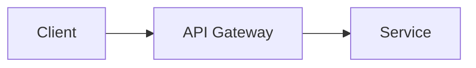

# Present: Professional Presentation Workflow

Creates professional presentations using Slidev + Bun. Source-controllable Markdown → live preview → PDF/PPTX export.

**Announce at start:** "I'm using the present skill to help you build a presentation."

## Prerequisites Check

Before anything else, verify Slidev is available:

```fish
bunx @slidev/cli --version
```

If this fails, tell the user:
> "Slidev isn't installed. Run: `bun add -g @slidev/cli` then try again."

Stop here if installation fails.

## Entry Point Detection

Determine how the user invoked the skill:

| Input | Mode |
|---|---|
| A brief or topic string | **Generate mode** — Claude drives content from scratch |
| Pasted notes, doc, or outline | **Assist mode** — Claude restructures provided content |
| A path to `slides.md` | **Revise mode** — Claude reads and modifies existing deck |

If unclear, ask: "Are you starting from scratch, working from existing notes, or revising a deck you already have?"

## Confidentiality Refusal (when invoked from an /onboard workspace)

When the entry path is a `slides.md` path (Revise mode) OR the user pastes
content from a workspace path (Assist mode), MUST run the refusal guard
before reading the source:

```fish
bun run "$CLAUDE_PROJECT_DIR/skills/onboard/scripts/onboard-guard.ts" refuse-raw <path>
```

`CLAUDE_PROJECT_DIR` is the harness-provided absolute path to the repository
root. If the env var is not set, resolve the repo root by walking up from
CWD until a `.git` directory is found.

Exit-code contract for this call-site:

| Exit | Meaning | Action |
|---|---|---|
| 0 | Path is outside any `interviews/raw/` directory | proceed to read |
| 2 | Path is inside `interviews/raw/` (refused) | surface stderr, abort, do NOT read the file |
| 64 | Misuse (wrong arg count) | bug — file an issue |

The guard is a no-op for non-workspace paths — exits 0, /present proceeds.
The canonical contract (override policy, name-extraction rules, deferred
items) lives in the onboard skill's `refusal-contract.md`.

## Step 1: Audience & Intake

Ask these questions **one at a time**:

1. **Audience type** — choose one or more:
   - A) Executive / leadership
   - B) Technical / engineering
   - C) Client / external

2. **Key message** — "What's the one thing the audience must walk away knowing?"

3. **Length** — How many slides approximately? (Or: how much time do you have?)

4. **Must-include elements** — Any specific data, diagrams, or constraints to include?

In **Revise mode**, skip intake and ask instead: "What needs to change — audience shift, new data, restructure, or something else?"

In **Assist mode**, run the full intake — but when asking about length (question 3), note that the provided content may naturally determine slide count. Offer a suggested count based on the content volume and let the user override.

## Step 2: Narrative Outline

Generate a slide-by-slide outline based on the intake. Apply audience content rules:

| Audience | Content rules |
|---|---|
| Executive | Max 3 bullets/slide, lead with business impact, use `fact` layout for key metrics |
| Technical | Code blocks welcome, architecture diagrams encouraged, higher density allowed |
| Client/external | Clean visuals, minimal jargon, strong narrative arc with clear call-to-action |

Present the outline to the user. Ask: "Does this narrative arc look right? Any slides to add, remove, or reorder?"

Iterate on the outline until the user approves it. Do not write Markdown until the outline is approved.

## Step 3: Generate slides.md

Once the outline is approved, write the presentation to:

```
~/presentations/<slug>/slides.md
```

Where `<slug>` is a kebab-case version of the presentation title (e.g., "Q3 Engineering Roadmap" → `q3-engineering-roadmap`).

### Default Frontmatter

Every presentation starts with:

```yaml
---
theme: default
colorSchema: dark
highlighter: shiki
lineNumbers: false
fonts:
  sans: 'Inter'
  mono: 'JetBrains Mono'
transition: slide-left
---
```

Note: use `colorSchema: light` when the context requires it (printed handouts, bright projection rooms).

### Layouts

| Layout | When to use |
|---|---|
| `cover` | Title slide — large headline, subtitle, date |
| `default` | General content — text, bullets |
| `two-cols` | Side-by-side comparisons |
| `center` | Key statements, quotes, call-to-action |
| `fact` | Single large stat or highlight |

### Slide Separator

Separate slides with `---` on its own line. To set a layout for a specific slide:

```markdown
---
layout: fact
---

# 47%
Reduction in time-to-deploy after migrating to the new pipeline
```

### Diagram Blocks

Use the right block for each diagram type:

**Mermaid (flow, sequence, architecture):**



**Chart.js (data visualizations):**

```chart
type: bar
data:
  labels: [Q1, Q2, Q3, Q4]
  datasets:
    - label: Revenue ($M)
      data: [1.2, 1.8, 2.1, 2.4]
```

**Code blocks (technical slides) — syntax highlighted via Shiki:**

```typescript
const result = await fetch('/api/data')
const data = await result.json()
```

## Step 4: Live Preview

After writing slides.md, tell the user:

> "Slides written to `~/presentations/<slug>/slides.md`. Start the preview with:"
>
> ```fish
> cd ~/presentations/<slug> && bunx @slidev/cli slides.md
> ```
>
> "This opens at http://localhost:3030 and hot-reloads on every save."

## Step 5: Iteration

Stay in the conversation for revision requests. Edit `slides.md` directly — the user never needs to touch the file manually.

Handle requests like:
- "Make slide 3 punchier" → rewrite that slide's content
- "Add a diagram showing the auth flow" → insert the Mermaid block on the correct slide
- "Restructure slides 4–7, the narrative is off" → rewrite that section
- "Switch to light mode" → change `colorSchema: dark` to `colorSchema: light`
- "Add a data chart for Q3 metrics" → insert a Chart.js block with the provided data

After each edit, confirm what changed: "Updated slide 3 — shortened to 2 bullets and sharpened the headline."

## Step 6: Export

When the user is ready to export:

```fish
# PDF
cd ~/presentations/<slug> && bunx @slidev/cli export slides.md --format pdf

# PowerPoint
cd ~/presentations/<slug> && bunx @slidev/cli export slides.md --format pptx
```

Both files land in `~/presentations/<slug>/`.

### Export Troubleshooting

If export fails because the theme is missing (cannot prompt for installation):

Start the dev server once first — it installs missing themes automatically:
```fish
cd ~/presentations/<slug> && bunx @slidev/cli slides.md
```
Then stop it (`Ctrl+C`) and re-run the export command.

If export fails because Chromium is unavailable:

1. Install Playwright's Chromium browser (one-time, ~92MB):
   ```fish
   bunx playwright install chromium
   ```
2. Re-run the export command.
3. If still failing: open `http://localhost:3030` and use browser print-to-PDF as fallback.
4. For PPTX: export requires Chromium. If unavailable, export PDF first and note the PPTX limitation.

Note: Slidev's PPTX export embeds slide images — the output is not text-editable in PowerPoint. This is acceptable for presentation use; if the recipient needs to edit the deck, deliver PDF instead.

## When NOT to Use

- One-off documents, memos, or reports — deliver as a Word document (`.docx`) instead
- A quick outline or bullet list that doesn't need to be rendered — just reply in Markdown
- Technical documentation that belongs in a README or runbook
- The user wants a static image or diagram only — use excalidraw or mermaid directly
- Slidev is not installed and the user doesn't want to install it — don't try to fake slides in another format

## Common Mistakes

- **Generating `slides.md` before the outline is approved** — always iterate on the narrative arc first; writing Markdown early wastes cycles when the structure changes.
- **Over-dense executive slides** — executive audiences get max 3 bullets per slide, business-impact-first phrasing, and `fact` layout for key metrics (per the audience content rules).
- **Skipping the audience question** — audience drives content rules; don't guess between executive, technical, and client/external.
- **Misusing layouts** — reaching for `default` for every slide loses visual rhythm; use `cover`, `fact`, `center`, and `two-cols` where they fit.
- **Claiming export succeeded without running it** — when asked to export, actually run the command and confirm the output files exist before reporting success.

## Source Control

Each presentation directory is independently git-trackable:

```fish
cd ~/presentations/<slug>
git init
git add slides.md
git commit -m "Initial deck: <title>"
```

`slides.pdf` and `slides.pptx` should be gitignored (generated artifacts). The `slides.md` file is the source of truth.
