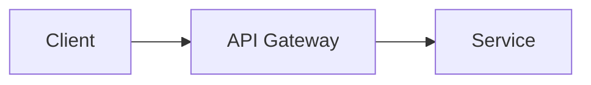

# Slidev Syntax Reference

Used by `skills/present/SKILL.md` Step 3 (Generate slides.md). Loaded on demand.

## Default Frontmatter

Every presentation starts with:

```yaml
---
theme: default
colorSchema: dark
highlighter: shiki
lineNumbers: false
fonts:
  sans: 'Inter'
  mono: 'JetBrains Mono'
transition: slide-left
---
```

Note: use `colorSchema: light` when the context requires it (printed handouts, bright projection rooms).

## Layouts

| Layout | When to use |
|---|---|
| `cover` | Title slide — large headline, subtitle, date |
| `default` | General content — text, bullets |
| `two-cols` | Side-by-side comparisons |
| `center` | Key statements, quotes, call-to-action |
| `fact` | Single large stat or highlight |

## Slide Separator

Separate slides with `---` on its own line. To set a layout for a specific slide:

```markdown
---
layout: fact
---

# 47%
Reduction in time-to-deploy after migrating to the new pipeline
```

## Diagram Blocks

Use the right block for each diagram type:

**Mermaid (flow, sequence, architecture):**



**Chart.js (data visualizations):**

```chart
type: bar
data:
  labels: [Q1, Q2, Q3, Q4]
  datasets:
    - label: Revenue ($M)
      data: [1.2, 1.8, 2.1, 2.4]
```

**Code blocks (technical slides) — syntax highlighted via Shiki:**

```typescript
const result = await fetch('/api/data')
const data = await result.json()
```
